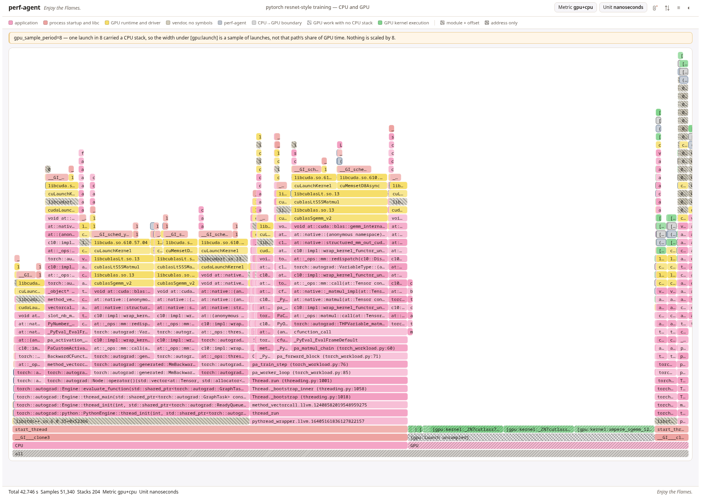

*eBPF-based Linux profiler — CPU, GPU and off-CPU in one flame graph, with CUDA kernels correlated to the launching stack. System-wide or per-PID, pprof output.*

[](https://github.com/dpsoft/perf-agent/actions/workflows/ci.yml)
[](https://github.com/dpsoft/perf-agent/actions/workflows/tests.yml)
[](https://pkg.go.dev/github.com/dpsoft/perf-agent)
[](go.mod)
[](LICENSE)

---



*One capture of a live PyTorch step: `pa_train_step (torch_workload.py:76)` under
`Thread.run`, down through `torch::autograd` and `cublasSgemm_v2`, across the
`[gpu:launch]` boundary into the CUDA kernel — Python, C++ and GPU in one tree.
[Interactive version](docs/flamegraph-pytorch-gpu.html).*

---

## What it does

- **CUDA kernels under the stack that launched them**, joined on CUPTI's
  correlation id — a slow kernel points at the call path responsible, Python
  frames included. [How the adapter is loaded →](docs/gpu-injection.md)
- **Python frames walked from BPF**, out of the interpreter's own frame chain.
  No injection into the target, no `CAP_SYS_PTRACE`, nothing mutated. CPython
  3.12–3.14. [How the walk works →](docs/cpython-frame-walking.md)
- **Off-CPU stalls**: `--offcpu` hooks `sched_switch` and accumulates blocking
  time per call site — lock waits, syscall blocks, mutex contention.
- **Release C++/Rust without frame pointers**, via a hybrid FP + `.eh_frame`
  CFI walker. Node.js, Go and any runtime writing `/tmp/perf-<pid>.map` too.
- **Stripped production binaries**, symbolized from `.gnu_debugdata` or fetched
  off-box. [debuginfod setup →](docs/debuginfod-symbolization.md)
- **Hardware counters and Kubernetes labels**, for PMU investigations and
  per-pod attribution.

Hot-attach to a running process — no restart, no preinstalled agent. The agent
never writes to the process it measures.

## Quickstart

```bash
# Build (one-time; see BUILDING.md for the toolchain)
make build

# Grant capabilities once so later runs don't need sudo
sudo setcap cap_bpf,cap_perfmon,cap_sys_ptrace,cap_checkpoint_restore,cap_syslog+ep ./perf-agent

# Capture a 30-second CPU profile of one process
./perf-agent --profile --pid <PID> --duration 30s

# Inspect
go tool pprof <output>.pb.gz
```

`cap_syslog` is what makes `/proc/kallsyms` return real addresses; without it
kernel frames stay unsymbolized with no error. On kernels older than 5.9, add
`cap_sys_admin`.

For CPU + GPU in one tree, see [Usage](docs/usage.md#gpu).

## Documentation

| | |
|---|---|
| [Usage and flags](docs/usage.md) | every flag, with the examples |
| [Requirements](docs/requirements.md) | kernel, capabilities, distro notes |
| [Architecture](docs/architecture.md) | how a sample becomes a profile |
| [Output](docs/output.md) | file naming, pprof fidelity, PMU format |
| [What you can do](docs/use-cases.md) | the capabilities above, in full |
| [Library usage](docs/library-usage.md) | embedding the agent in Go |
| [Building](BUILDING.md) · [Testing](TESTING.md) | toolchain and test gates |
| [Releases](RELEASES.md) · [Changelog](CHANGELOG.md) | what shipped when |

Deeper notes: [GPU injection](docs/gpu-injection.md) ·
[CPython frame walking](docs/cpython-frame-walking.md) ·
[debuginfod symbolization](docs/debuginfod-symbolization.md) ·
[perf.data output](docs/perf-data-output.md)

---

[Contributing](CONTRIBUTING.md) ·
[Code of conduct](CODE_OF_CONDUCT.md) ·
[Security](SECURITY.md) ·
[License](LICENSE) (Apache-2.0)
