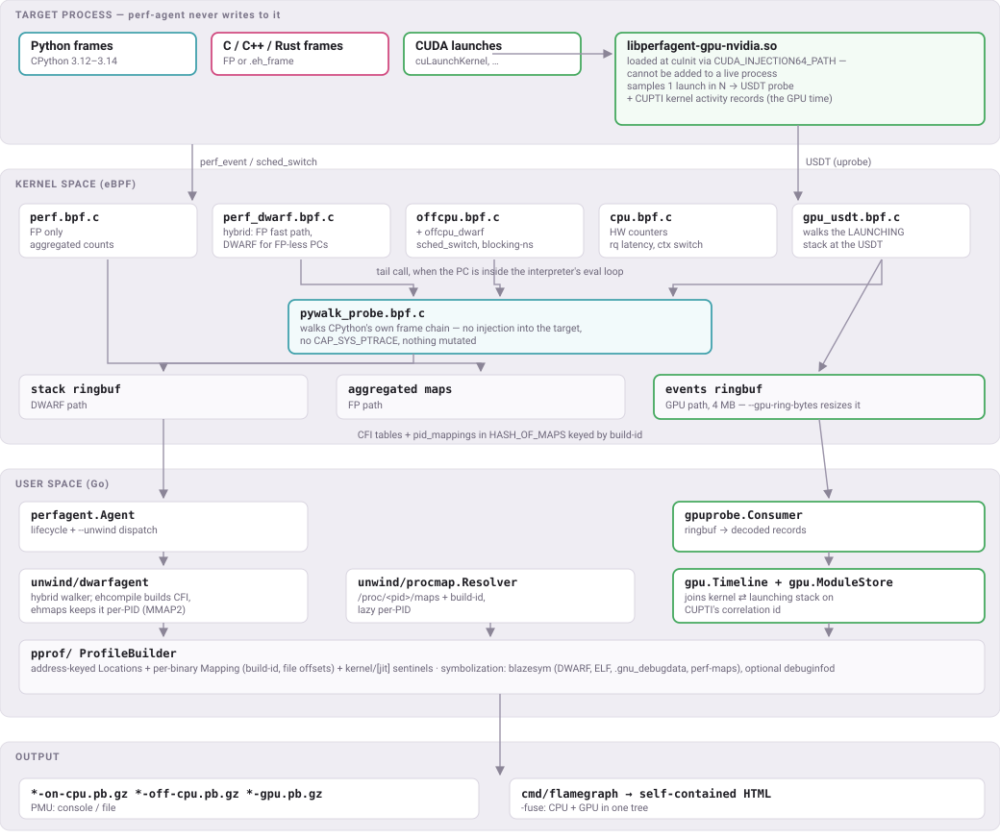

# Architecture

Two stack-walker paths: **`--unwind fp`** (cheap, kernel-side aggregation; truncates on FP-less code) and **`--unwind dwarf`** / **`auto`** (default — FP fast path with `.eh_frame`-derived CFI fallback for release C++/Rust without frame pointers).

Sample addresses resolve through `procmap.Resolver` (lazy `/proc/<pid>/maps` + build-id), so each pprof `Mapping` carries real per-binary identity and each `Location` is keyed by `(mapping_id, file_offset)` — what `go tool pprof -diff_base` and sample-based PGO converters need to round-trip.

---
